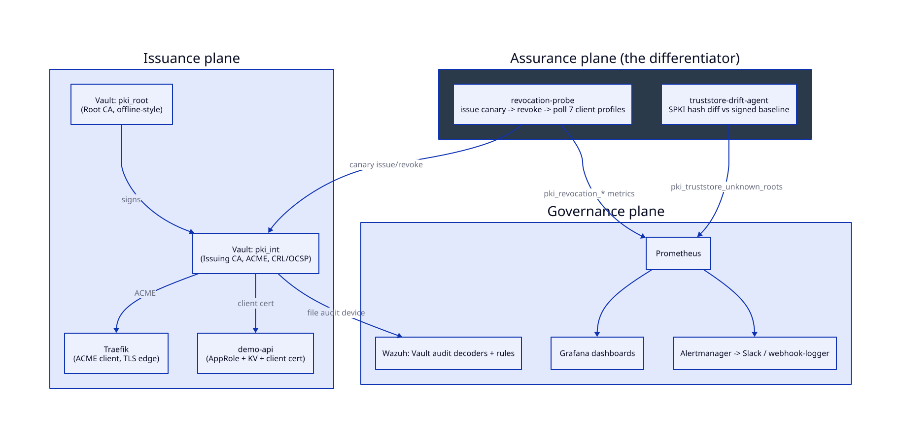

# pki-sentinel

**Internal PKI for SMEs with continuous evidence that clients reject revoked certificates.**


The terminal demo recording is reproducible with
[`docs/images/demo.tape`](docs/images/demo.tape) after the stack passes
`make bootstrap`.

## Rationale

Many SMEs running internal services either omit TLS, maintain an unrotated
self-signed CA, or deploy PKI without an ongoing certificate lifecycle.
Certificate issuance and renewal often remain manual processes.

Organizations that deploy certificate revocation rarely verify client
enforcement. Revocation checking is treated as a checkbox — CRL distribution
point configured, OCSP responder running — rather than a property that has to
be continuously measured against real client behavior.

That gap is not hypothetical. A controlled private-CA testbed (see
[`docs/benchmarks/`](docs/benchmarks/)) showed the OCSP soft-fail transition
is a narrow, jittery band rather than a clean threshold — soft-fail rates
reached 100% at several injected-delay points near the client timeout rather
than only beyond a stable cutoff. The same testbed showed a
trusted-CA MITM succeeds in 100% of trials with zero client-side warning,
because that failure mode is invisible at the TLS layer by design. Both
findings and their reproduction in this repository are documented in
[`docs/benchmarks/`](docs/benchmarks/).

pki-sentinel treats revocation enforcement as a continuously measured product
feature (the **Assurance plane**) rather than a one-time laboratory finding.

## Quick start (3 commands)

Prerequisites: Docker Engine/Desktop with Compose v2, Terraform 1.9.5,
`curl`, and `jq`.

```bash
cp .env.example .env
make up
make bootstrap
```

Run the primary revocation-enforcement demonstration:

```bash
make demo-revoke
```

## Architecture

pki-sentinel has three planes. The Assurance plane is the differentiator —
see [`docs/architecture.md`](docs/architecture.md) for the full diagram and
[ADR-0004](docs/adr/0004-assurance-plane-first-class.md) for why.



| Plane | Responsibility |
|---|---|
| **Issuance** | Vault/OpenBao PKI (Root + Intermediate), ACME endpoint, Traefik edge, short-lived certs |
| **Assurance** | `revocation-probe` continuously issues a canary cert, revokes it, and measures each client profile's result. `truststore-drift-agent` detects unauthorized root CA installation. |
| **Governance** | Prometheus/Grafana/Alertmanager, Wazuh custom decoders for Vault audit logs, OPA policy gates in CI |

## Included capabilities

- A production-shaped Vault PKI hierarchy (Raft storage, transit
  auto-unseal, offline-style root, ACME-issuing intermediate) fully
  declared in Terraform.
- Traefik obtaining certificates from Vault's ACME endpoint with zero
  manual steps.
- A continuous revocation-enforcement probe across 7 real client
  configurations (`openssl`, `curl` with and without `--cert-status`, Go
  `crypto/tls`, Python `requests`, CRL-based checking).
- A repeatable `tc netem` latency-injection sweep that reproduces the OCSP
  soft-fail transition-band finding on demand.
- A trust-store drift detector for the one MITM scenario that TLS itself
  cannot see.
- Prometheus/Grafana/Alertmanager wired end-to-end, including a working
  alert path even without a real Slack workspace.
- Wazuh decoders/rules over Vault's audit log, keyed on security-significant
  events (a root-CA write outside bootstrap, AppRole brute force, policy
  changes).
- A CI pipeline that gates on security *properties* (an integration test
  that asserts revocation detection by real clients), not only lint.

## Try the demo

```bash
make demo-revoke              # one probe cycle; detection table with soft-fail rows
make chaos-sweep              # latency sweep; writes docs/benchmarks/data/chaos-*.csv
make truststore-drift-demo    # installs a synthetic rogue CA and verifies detection
```

## Verification workflow

Run the gates in this order from a clean checkout:

```bash
make bootstrap                # clean-stack bootstrap, PKI apply, ACME, AppRole, root-token revocation
make demo-revoke              # writes .data/last-cycle.json after the 180-second enforcement cycle
make test-integration         # validates the cycle report, live metrics, and signed trust-store drift
make truststore-drift-demo    # isolated rogue-root detection test
make up-full                  # starts Prometheus, Grafana, Alertmanager, and the webhook receiver
make test                     # Go unit tests with the race detector
make lint                     # Shell, Terraform, Go, and Dockerfile linters
make scan                     # Gitleaks and Trivy; both commands fail on findings
```

`make clean` removes containers, generated credentials, Vault recovery
material, local TLS keys, and Terraform state. The integration target consumes
the report produced by `make demo-revoke`, which keeps macOS and Linux results
consistent even though the macOS system curl lacks `--cert-status` support.

## Client profile results table

The baseline matrix identifies which clients check revocation and which do
not. `make demo-revoke` reproduces it against the running stack.

| Profile | Method | Expected baseline |
|---|---|---|
| `openssl-ocsp-direct` | OCSP (direct query) | **rejected** — ground-truth oracle |
| `curl-cert-status` | OCSP (stapled) | rejected when stapling on; **accepted** when stapling off |
| `curl-default` | none | **accepted** — curl does no revocation check by default |
| `go-tls-default` | none | **accepted** — Go stdlib does not check revocation |
| `go-tls-ocsp` | OCSP (stapled) | rejected when stapled |
| `python-requests` | none | **accepted** |
| `crl-check` | Delta CRL | rejected after the one-minute delta rebuild interval |

Most default client configurations accept a revoked certificate
indefinitely. That is not a bug in the harness — it is this product's
reason to exist.

## Production notes

This deployment makes several deliberate, documented shortcuts for demo
convenience. None of them are hidden — see also `SECURITY.md` and
`docs/threat-model.md`.

| Demo shortcut | Risk | Production fix |
|---|---|---|
| Root CA online in Vault | root key compromise = total trust failure | offline root on HSM/smartcard; sign the intermediate manually, annually |
| Transit auto-unseal via a second Vault | seal Vault compromise unseals everything | AWS KMS / GCP KMS / Azure Key Vault / HSM |
| Vault listener `tls_disable = true` | plaintext on the Docker bridge | TLS on the listener with a bootstrap cert |
| Recovery keys in `.data/vault-init.json` | plaintext key material on disk | PGP-encrypted shares distributed to separate key holders |
| `GRAFANA_ADMIN_PASSWORD` in `.env` | trivial credential | SSO/OIDC |
| ACME with no External Account Binding | any workload on the network can request a cert | `eab_policy: always-required` |

## Roadmap

- Kubernetes/Helm chart (see [ADR-0005](docs/adr/0005-compose-over-kubernetes.md))
- HSM-backed root CA
- cert-manager issuer for the Vault PKI backend
- Windows trust-store drift agent
- EST/SCEP support alongside ACME

## License

Apache-2.0 — see [`LICENSE`](LICENSE).

## Acknowledgements

Built on HashiCorp Vault, Traefik, Prometheus, Grafana, and Wazuh.

## Research basis

- [`docs/benchmarks/ocsp-softfail-thresholds.md`](docs/benchmarks/ocsp-softfail-thresholds.md)
  documents the private-CA and `tc netem` latency methodology and its data
  limitations.
- [`docs/benchmarks/trusted-ca-mitm.md`](docs/benchmarks/trusted-ca-mitm.md)
  documents the trusted-root interception result and trust-store control.
