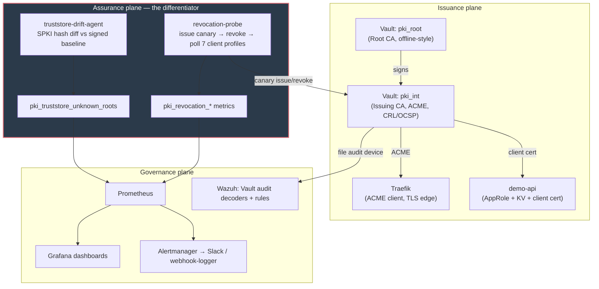

# Architecture

pki-sentinel has three planes. The Assurance plane is the differentiator —
see [ADR-0004](adr/0004-assurance-plane-first-class.md).

| Plane | Responsibility |
|---|---|
| **Issuance** | Vault/OpenBao PKI (Root + Intermediate), ACME endpoint, Traefik edge, short-lived certs |
| **Assurance** | `revocation-probe` continuously issues a canary cert, revokes it, and measures whether each client profile actually rejects it. `truststore-drift-agent` detects unauthorized root CA installation. |
| **Governance** | Prometheus/Grafana/Alertmanager, Wazuh custom decoders for Vault audit logs, OPA policy gates in CI |

See [`docs/diagrams/architecture.d2`](diagrams/architecture.d2) for the
regenerable source (`make diagrams`).

## ADR index

- [0001 — Vault vs step-ca](adr/0001-vault-vs-step-ca.md)
- [0002 — Auto-unseal trade-offs](adr/0002-auto-unseal-tradeoffs.md)
- [0003 — Short-lived certs over revocation](adr/0003-short-lived-certs-over-revocation.md)
- [0004 — Assurance plane as first-class](adr/0004-assurance-plane-first-class.md)
- [0005 — Compose over Kubernetes for v1](adr/0005-compose-over-kubernetes.md)
- [0006 — Alpine over distroless for the probe](adr/0006-alpine-over-distroless-for-probe.md)
- [0007 — Alerting on method != none only](adr/0007-alerting-on-method-not-none-only.md)
