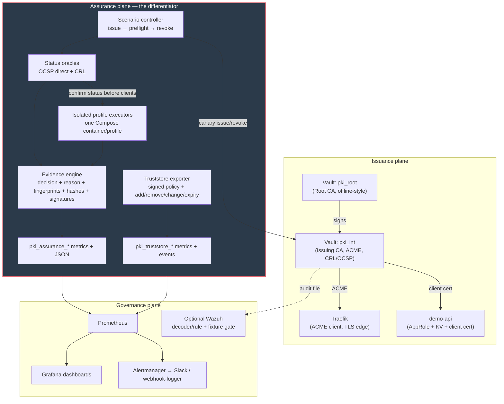

# Architecture

pki-sentinel has three planes. The Assurance plane is the differentiator —
see [ADR-0004](adr/0004-assurance-plane-first-class.md).

| Plane | Responsibility |
|---|---|
| **Issuance** | Vault issuer adapter, Root + Intermediate, ACME endpoint, Traefik edge, short-lived canaries |
| **Assurance** | Scenario controller, isolated OCSP/CRL status oracles and relying-party executors, decision/reason evidence, signed attestations, signed trust-policy conformance |
| **Governance** | Bounded Prometheus metrics, Grafana assurance matrix, Alertmanager, CI security-property, Terraform-plan policy, and Wazuh fixture tests |

## Evidence semantics

Every executor produces a decision and an independent reason:

- `ACCEPT`: the relying party completed the TLS operation, or an oracle
  reported a good status.
- `REJECT`: the client refused the connection or an oracle confirmed that the
  certificate must not be trusted.
- `INCONCLUSIVE`: network or TLS conditions prevented a revocation conclusion.
- `HARNESS_ERROR`: the experiment itself was invalid.

Reasons include `REVOKED`, `MISSING_STATUS`, `INVALID_STATUS`,
`STALE_STATUS`, `UNKNOWN_STATUS`, `NO_REVOCATION_CHECK`, `NETWORK_FAILURE`,
`TLS_FAILURE`, and `HARNESS_FAILURE`. A generic TLS or network failure is never
counted as successful revocation enforcement.

Status oracles execute and satisfy their scenario contracts before client
executors run. This ordering prevents a client observation from being treated
as post-revocation evidence before the selected status channels have propagated
the revocation.

Certificate serials, client versions, TLS backends, exit codes, and output
hashes are retained in JSON evidence. They are deliberately excluded from
Prometheus labels to keep cardinality bounded.

An optional Ed25519 attestation envelope signs the exact JSON cycle report,
records both payload and public-key SHA-256 values, and can be verified without
the controller. A local file key is only a demo integration; production keys
belong behind an external KMS or HSM signing boundary.

## Current boundaries

- Vault is the implemented issuer adapter; the assurance model is not intended
  to depend on Vault-specific behavior.
- Every enabled profile executes in a distinct Compose service. The services
  currently derive from one digest-pinned executor image, so binary diversity
  still depends on the Alpine package set selected for that digest.
- The chaos command measures a direct OCSP oracle through a loopback fault
  proxy that accepts only the OCSP responder path. The proxy can inject delay,
  drop, timeout, HTTP 500, malformed response, and reset faults. The default
  sweep remains a direct-oracle latency experiment, not a client-specific
  soft-fail threshold measurement.
- OPA validates both regression fixtures and the Terraform plan emitted from
  the live CI bootstrap stack.
- Wazuh remains optional; CI runs `wazuh-logtest` against the revocation audit
  fixture, but the repository does not claim a full Wazuh indexer/dashboard
  deployment.

See [`docs/diagrams/architecture.d2`](diagrams/architecture.d2) for the
regenerable source (`make diagrams`).

## ADR index

- [0001 — Vault vs step-ca](adr/0001-vault-vs-step-ca.md)
- [0002 — Auto-unseal trade-offs](adr/0002-auto-unseal-tradeoffs.md)
- [0003 — Short-lived certs over revocation](adr/0003-short-lived-certs-over-revocation.md)
- [0004 — Assurance plane as first-class](adr/0004-assurance-plane-first-class.md)
- [0005 — Compose over Kubernetes for v1](adr/0005-compose-over-kubernetes.md)
- [0006 — Alpine over distroless for the probe](adr/0006-alpine-over-distroless-for-probe.md)
- [0007 — Alerting on method != none only](adr/0007-alerting-on-method-not-none-only.md)
